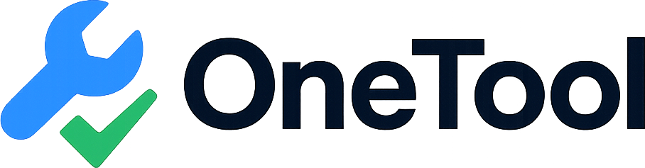
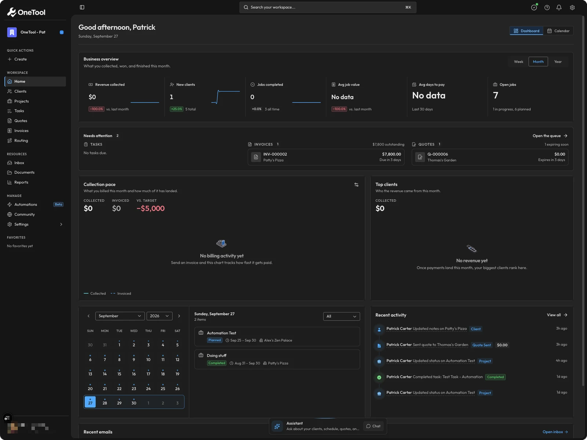
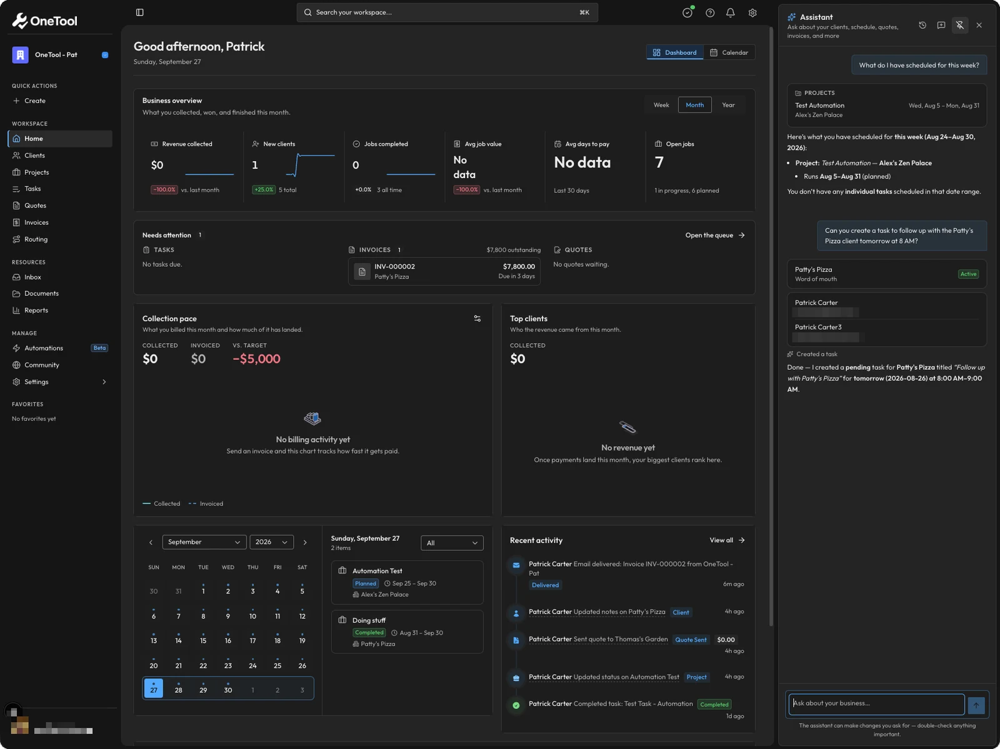
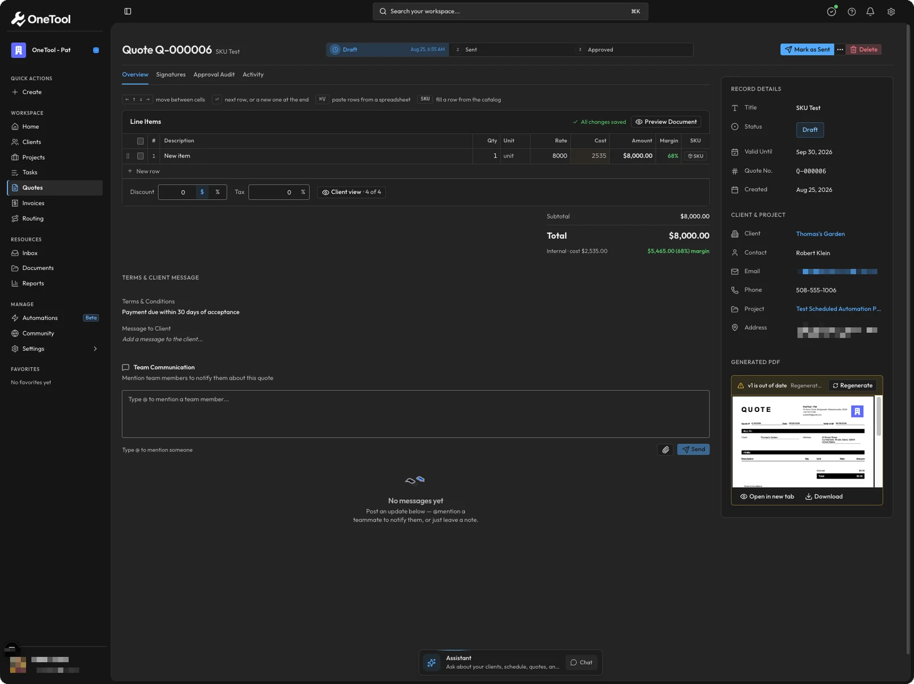
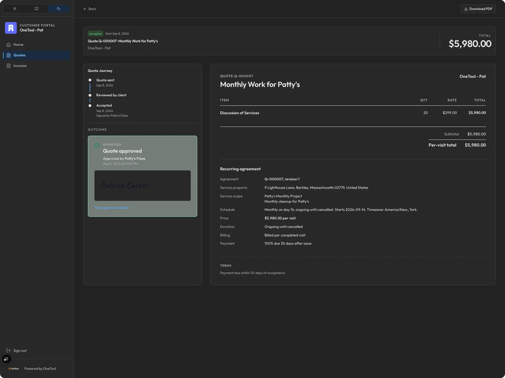
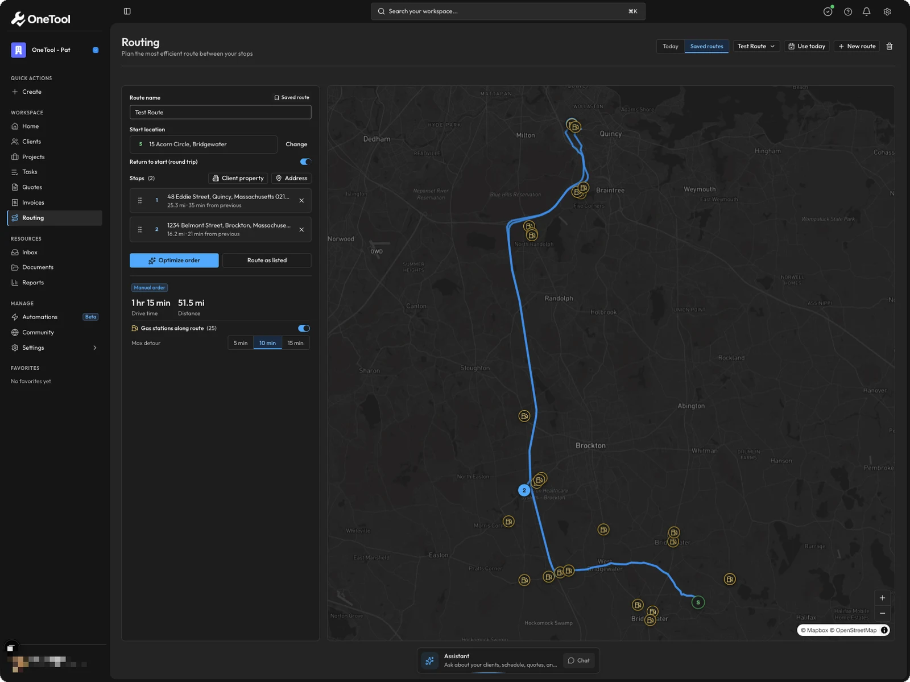
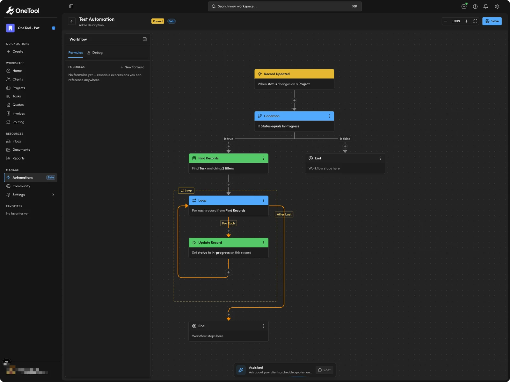
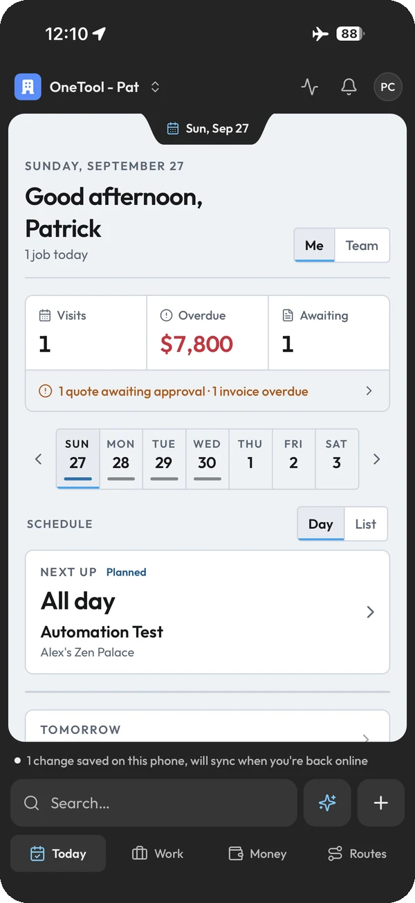

<p align="center">
  <a href="https://www.onetool.biz">
    <picture>
      <source media="(prefers-color-scheme: dark)" srcset="./docs/readme/wordmark-dark.png" />
      <source media="(prefers-color-scheme: light)" srcset="./docs/readme/wordmark-light.png" />
      
    </picture>
  </a>
</p>

<h3 align="center">Business management for HVAC, landscaping, cleaning and the trades</h3>

<p align="center">
  <a href="https://www.onetool.biz">Website</a> ·
  <a href="https://www.onetool.biz/help">Help center</a> ·
  <a href="https://apps.apple.com/us/app/onetool-small-business-crm/id6757319255">iOS app</a> ·
  <a href="https://www.onetool.biz/data-security">Data security</a>
</p>

<p align="center">
  <a href="https://www.onetool.biz">
    
  </a>
</p>

<br />

# Why OneTool

Most small service businesses run on a spreadsheet, a notes app, a separate invoicing tool and a lot of retyping. OneTool puts the whole job in one place and makes it work from a phone in a truck.

You log a client once, with their contacts and properties. You price a quote from your own reusable products. The client e-signs it on their phone, and approval turns it into scheduled visits and tasks. The day comes back as an optimized driving route, and the invoice bills off the same numbers and gets paid by card. You never retype anything between steps.

<table align="center">
  <tr>
    <td align="center" width="120"><br /><b>Quote</b></td>
    <td align="center" width="120"><br /><b>Sign</b></td>
    <td align="center" width="120"><br /><b>Schedule</b></td>
    <td align="center" width="120"><br /><b>Invoice</b></td>
    <td align="center" width="120"><br /><b>Get paid</b></td>
  </tr>
</table>

<br />

# Get started

**On the web.** Sign up at [onetool.biz](https://www.onetool.biz). Every new organization gets a 14-day Business trial, and you don't need a credit card. When the trial ends you continue on the Free plan unless you subscribe.

**On your phone.** Download [OneTool for iPhone and iPad](https://apps.apple.com/us/app/onetool-small-business-crm/id6757319255) and sign in with the same account.

<br />

# What's inside

<table align="center">
  <tr>
    <td width="50%">
      
      <p align="center"><a href="https://www.onetool.biz/help/getting-started/navigating-the-workspace">Your business at a glance →</a></p>
    </td>
    <td width="50%">
      
      <p align="center"><a href="https://www.onetool.biz/help/ai-assistant/meet-the-assistant">Ask the assistant →</a></p>
    </td>
  </tr>
  <tr>
    <td width="50%">
      
      <p align="center"><a href="https://www.onetool.biz/help/quotes/creating-a-quote">Build a quote →</a></p>
    </td>
    <td width="50%">
      
      <p align="center"><a href="https://www.onetool.biz/help/client-portal/what-your-clients-see">Clients approve in their portal →</a></p>
    </td>
  </tr>
  <tr>
    <td width="50%">
      
      <p align="center"><a href="https://www.onetool.biz/help/routing/planning-a-route">Plan the day's route →</a></p>
    </td>
    <td width="50%">
      
      <p align="center"><a href="https://www.onetool.biz/help/automations/building-an-automation">Automate the busywork →</a></p>
    </td>
  </tr>
</table>

Anything tagged <kbd>Business</kbd> needs the Business plan, which the 14-day trial includes. Everything else is on every plan.

### Clients
- Board and table views that follow each client from Lead to Prospect, Active, Inactive and Archived
- Multiple contacts per client, with a primary contact, and multiple service properties
- CSV import with AI-assisted column mapping and duplicate detection
- Unlimited clients on every plan

### Quotes and e-signatures
- Line items from a reusable product and service library, with discounts and tax
- Sequential quote numbers that stay in order even when you type one by hand
- E-signatures through BoldSign, sent as part of the quote. When the client signs, OneTool files the signed PDF and approves the quote.
- One click turns an approved quote into an invoice

### Projects, tasks and scheduling
- One-off and recurring projects, tracked from Planned through Completed
- Recurring series with shared schedule, quote, agreement and billing setup
- Tasks with dates, time windows, priority, recurrence and assignees, on a project calendar and a shared task list
- Members see only the work assigned to them; admins see everything

### Invoices and payments
- Branded invoice PDFs, created from a quote or from scratch
- Payment schedules that split an invoice into dated installments
- Card payments through Stripe Connect, paid out to your own Stripe account
- Cash and check recording, refunds, and dispute tracking with Stripe's evidence deadlines
- Invoices move to Overdue on their own and notify the owner

### Client portal
- A private portal for every client, with sign-in by emailed one-time code and no password
- Clients review and approve quotes and pay invoices in one place
- Carries your logo and brand
- Remove the portal's OneTool badge <kbd>Business</kbd>

### Inbox
- One team inbox for all client email, plus an email tab on each client
- Threaded replies, branded templates, attachments, and a unique receiving address per organization
- Delivery, open and bounce tracking

### Routing <kbd>Business</kbd>
- Turn a day's stops into an optimized driving route on a map
- Save routes and reuse them for recurring runs

### Automations <kbd>Business</kbd>
- A visual builder for "when this happens, do that" workflows, triggered by events or on a schedule
- Dry runs before you publish, and a full run history

### Reports and dashboard
- Home dashboard with business stats, trend charts, a weekly calendar, revenue goals and an activity feed
- Report builder across clients, projects, quotes and invoices, with ready-made presets
- Describe a report in plain English and OneTool builds it <kbd>Business</kbd>

### AI assistant
- Ask questions about your real business data and take small actions from any page
- 10 messages a day on Free, unlimited on Business
- Have the assistant build saved reports and plan routes <kbd>Business</kbd>

### Community page
- A free public page for your business at `onetool.biz/communities/<your-page>`
- Services, pricing, hours, gallery, credentials and social links
- A quote-request form that turns each submission into a follow-up task

### Across the app
- <kbd>⌘</kbd> <kbd>K</kbd> search across clients, contacts, properties, projects, quotes, invoices and tasks, with results limited to what you're allowed to see
- @mentions and a notification center, with push notifications on mobile
- Admin and Member roles, with members' access widened area by area
- QuickBooks Online sync for clients, invoices and payments <kbd>Business</kbd>

<br />

# Mobile app

<table>
  <tr>
    <td width="60%" valign="top">
      <p>The iOS app opens on today's visits, overdue money and quotes waiting on a client, and it syncs with the web app in real time.</p>
      <ul>
        <li>Today, Work, Money and Routes tabs, plus the AI assistant one tap away</li>
        <li>Works without a signal: changes save on the phone and send once you're back in range, and conflicts go to a <b>Sync issues</b> list instead of being overwritten</li>
        <li>Clients can sign a quote in person on your phone, even with no signal</li>
        <li>Push notifications for mentions, approvals, payments and automations, each with its own toggle</li>
        <li>Switch between organizations without signing out</li>
      </ul>
      <p><a href="https://apps.apple.com/us/app/onetool-small-business-crm/id6757319255">Download on the App Store →</a></p>
    </td>
    <td width="40%" align="center">
      
    </td>
  </tr>
</table>

<br />

# Plans

Free is $0 forever. Business is $30 a month or $300 a year per organization. The Free plan meters usage instead of capping records, so clients and projects are unlimited on both.

| | Free | Business |
|---|:---:|:---:|
| Clients and projects | Unlimited | Unlimited |
| Team members | 5 | 20 |
| Document sends per month | 20 (+10 in any month you collect a card payment) | Unlimited |
| E-signatures per month | 5 | Unlimited |
| AI assistant messages per day | 10 | Unlimited |
| Saved reports | 5 | Unlimited |
| CSV import rows (lifetime) | 2,000 | Unlimited |
| Online payments, custom SKUs, documents, AI client import | ✓ | ✓ |
| Workflow automations | | ✓ |
| Route optimization | | ✓ |
| QuickBooks sync | | ✓ |
| AI report generation | | ✓ |
| Remove the portal's OneTool badge | | ✓ |
| Support | Best effort | 24-hour SLA |

<br />

# Stack

- [Next.js 16](https://nextjs.org/) and [React 19](https://react.dev/), styled with [Tailwind CSS 4](https://tailwindcss.com/) and [ReUI](https://reui.io/) components on [Base UI](https://base-ui.com/)
- [Convex](https://www.convex.dev/) for the real-time database and backend functions, with [@convex-dev/agent](https://www.convex.dev/components/agent) and the [AI SDK](https://ai-sdk.dev/) behind the assistant
- [Expo](https://expo.dev/) and [React Native](https://reactnative.dev/) for the iOS app, sharing the same Convex backend
- [Clerk](https://clerk.com/) for users, organizations and seats
- [Stripe Connect](https://stripe.com/connect) for payments, [Resend](https://resend.com/) for email, [BoldSign](https://boldsign.com/) for e-signatures, [Mapbox](https://www.mapbox.com/) for routing, [QuickBooks Online](https://quickbooks.intuit.com/) for accounting sync
- [pnpm](https://pnpm.io/) workspaces and [Turborepo](https://turbo.build/), tested with [Vitest](https://vitest.dev/) and [convex-test](https://docs.convex.dev/testing/convex-test)

<br />

# Repository

```
apps/
  web/            Next.js app: marketing site, workspace, client portal, help center
  mobile/         Expo app for iPhone and iPad
packages/
  backend/        Convex schema, functions, crons and tests
  help-content/   Help center articles, shared by web and mobile
```

To run it locally you need Node, pnpm 10, and development accounts for Convex, Clerk, Stripe, Resend, BoldSign, Mapbox and OpenAI, with their keys in each app's `.env.local`.

```bash
pnpm install
pnpm dev          # web, mobile and Convex together
pnpm dev:web      # or one at a time
pnpm dev:convex
pnpm test         # backend and app test suites
pnpm build
```

<br />

# Security

Every record belongs to one organization, and every backend query and mutation is scoped to the signed-in user's organization. Members only see the work they're assigned unless an admin widens their access. Read more on the [data security page](https://www.onetool.biz/data-security), along with the [privacy policy](https://www.onetool.biz/privacy-policy) and [terms of service](https://www.onetool.biz/terms-of-service).

# Support

Questions and feature requests go to [support@onetool.biz](mailto:support@onetool.biz). Most answers are already in the [help center](https://www.onetool.biz/help).
